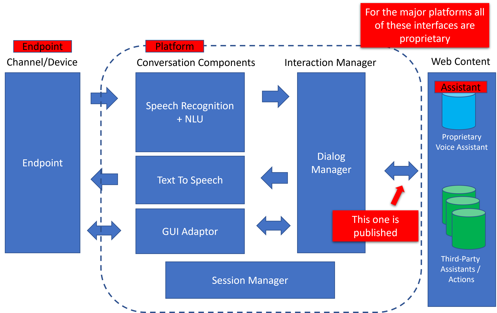
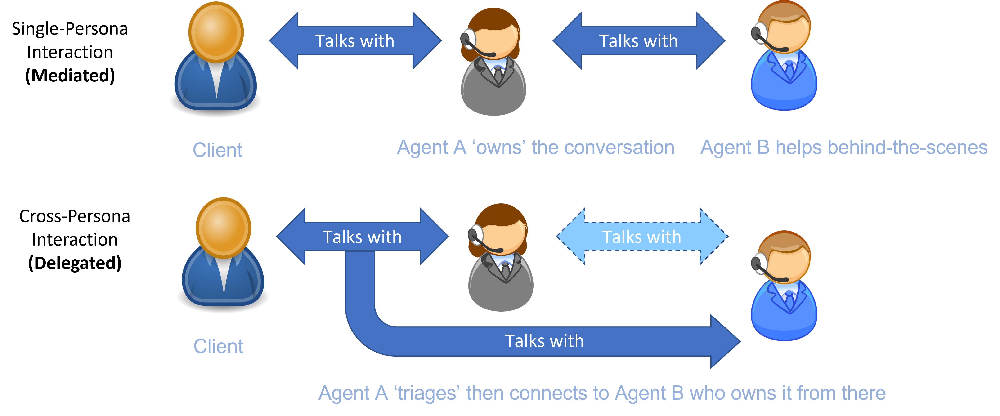
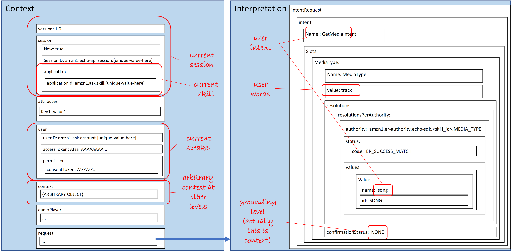
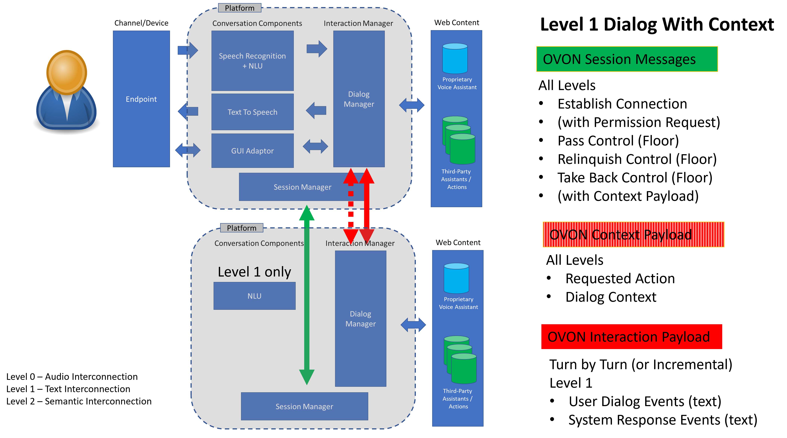
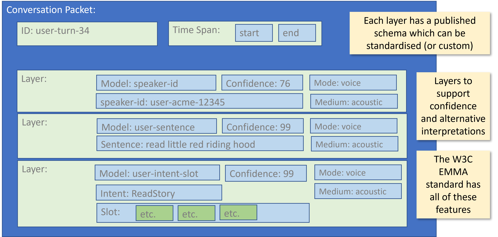
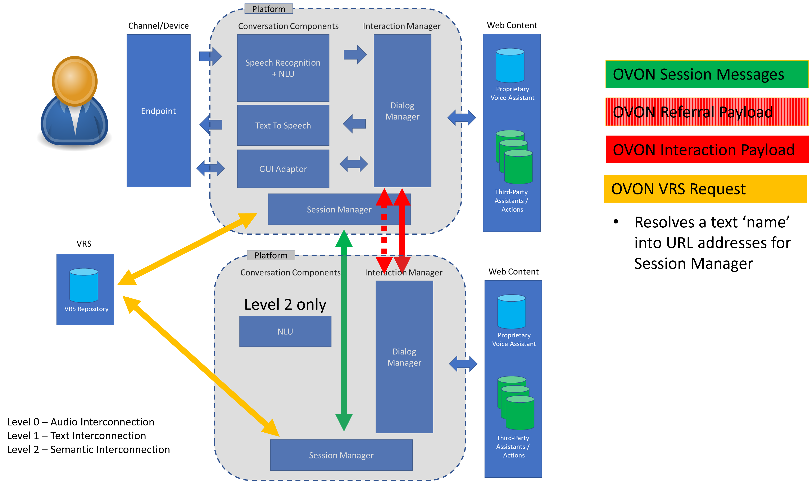
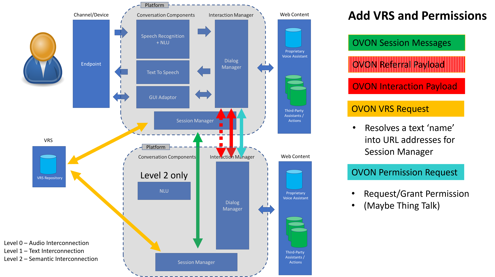

# Architecture Design

## Abstract

The Open Voice Network is a non-profit industry association, operating as a Directed Fund of The Linux Foundation, and dedicated to the development of technical standards and ethical use guidelines. This is an essential step for a technology and an industry that is in its earliest days, and for which user and developer value falls far short of envisioned potential.

This document proposes a target architecture for how voice platforms and content in different proprietarty formats can interwork using the OVON specifications.

This document will:

- Describe the anticipated architecture for interoperability between OVON compliant platoforms and agents.

- Provide a framework for the different working groups in OVON to develop different specifications in parallel with a common vision of where they are heading together

It will not:

- Describe exact messages or payload designs.

- Mandate which transport protocols (HTTP, RTP etc. are used)

This document is intended to build on the [Technical Master Plan](https://github.com/open-voice-network/docs/blob/master/technical_masterplan.md). In the short term these two documents may contradict one another as we develop the ideas. Such conflicts should be resolved as they occur.

The terminology used in this document assumes the reader has familiarity with the aforementioned document.

## Current Voice Assistant Model

Figure 1. Typical voice assitant architecture

Figure 1 shows a stylized view of a typical conversational system.  Endpoints are attached to one or more platforms and engage with the user via audio, text and visual media.    Platforms interpret content that embodies voice assistants and enables them to interact with users via the endpoint. 

### Endpoints

An example of a simple *endpoint*  would be an old-fashioned telephone (plain old telephony or POTS).  A sophisticated end-point might be an immervise VR environment.  What they all have in common is that they provide the interface between the user(s) and the conversational platform.  Standards exist for establishing audio connections between end-points and platforms, for example in POTS telephone systems or VoIP connections.   Smart speaker end-points currently use interfaces that are specific to the platform.  These may be published but they are not inter-operable between platforms.

### Platforms and Content

Most conversational systems have a separation between a *platform* and the *content* that is executed on that platform.  Web models are common with the content being static or active web-content.   A set of related standards proposed by the W3C Voice Browser committe has had considerable success created standards standardization of format for describing spoken dialog, speech recognition grammars, semantics, and pronunciations.    In general these standards served the telephony community well but have not been adopted by new wave of conversational platforms such as the dominant producers of smart speakers (i.e. Amazon and Google) or the plethora of text-based chatbot platforms.   It is common for these formats to be published but remain proprietary.  Example would include Amazon Skill definitions and Google Actions.

Speech recognition technology has moved from closed application-specific grammars to generic open language models.  This move has reduced the need for interoperability for grammar and language model specification.  

Natural Language Understanding has historically is typically specified by example (often called intents), or via fragments of simple grammar (often called slots).

### Voice Assistants

OVON draws a clear distinction between *platforms* and * voice assistants*  (known more generically as *converational agents*).

**Voice assistants* are manifested as converational user interfaces.  They hold conversation and are identifyable by users as conversational actors. A voice assistant will have identity and such as an identifyable voice and/or a name.  Put simply a user will recognise a voice assistant as a bounded entity and refer to via a pronoun such as he, she or it, or by a name.  The voice assistant may also refer to itself using a name or a pronoun.

Voice assistants are usually expressed in the form of *content* (usually web content).  This content describes how the assistant acheives certain tasks via conversation. 

The content that defines the behaiour of the assistant is then interpreted by a voice platform to actually engage in conversation with a user who is connected to an endpoint.

If an end-point and it associated platofmr) is intended for generic access to content then it may have a host voice assistant.  Host assistants will provide a gateway into delegate content (i.e. you have to ask the host assitant to give you access to a delegate assistant).   

With the exception of assitants written in the VoiceXML standard, delegate assistants are currently authored by a third party specifically for a given platform.     

Endpoints and platforms are currently closely coupled with proprietary (but often published) interfaces.  They handle wakewords, audio coding and streaming and graphical events and content.

### Examples

| End-point              | Platform           | Host Assistant   | Delegate Assistant(s) |
| ---------------------- | ------------------ | ---------------- | --------------------- |
| Echo                   | Amazon             | Alexa            | BBC Radio 4, Target   |
| Google Home            | Google             | (Hey) Google     | BBC Radio 4, Target   |
| ACME Bank Phone Number | Cisco Voice Portal | ACME Banking IVR |                       |

## Design Principles

## Diverse Ecosystem of Platforms

The OVON architecture seeks to establish standardized communication protocols between dialog agents running on diverse platforms.

It does not seek to standardize platform components or the format of content used to configure such components.  OVON envisages a world in which conversational systems will continue to evolve in complexity and function.  

As such the OVON architecture celebrates diversity in the following areas:

- The diversity of underlying technology (i.e. speech recognition, language understanding and dialog modelling.

- The diversity of endpoints (e.g. smart speakers, smart phone apps, dumb phones (POTS), audio-enabled web pages etc.)

- The diversity of conversational design paradigms

- The diversity of labels used to represent semantic content

The OVON architecture seeks to establish standards in the following areas:

- The method by which a spoken agent name can be used to find an associated agent.

- The way that control is handed between dialog agents

- The way that basic linguistic information is communicated in such hand-offs
  
  - Immediate linguistic context
  
  - Dialog history

- The way that dialog agents negotiate trust (to be discussed further)

### Model interoperability on how people do it

OVON does not envisage that a standard methodology for expressing and describing conversational interaction is possible or even desirable. Any attempts to describe how conversation can be modelled will quickly become outdated as the field of conversational interaction innovates.

Human languages can be considered the ultimate inter-operability standard.  People  have internal hidden motivations and knowledge.  They use language to align their understanding of the world and tasks to be achieved.   In some conversations people will have enormous levels of trust and shared understanding prior to the interaction. In others they will be complete strangers and may have not trust each other.

Instead OVON envisiges a model where autonomous agents collaborate to achieve a goal together using standard ways to share information with each other, operating a various levels of trust and information sharing.

 

Figure 2. Example of mediated and delegated communication.

Figure 2 shows two examples of how people inter-operate to achieve a conversational task, in this case between a 'cleint' and a helping 'agent'.    In the top example of mediated communication, the client interacts with a single agent.  Agent A owns the conversation but may talk with others (e.g. agebt B) behind the scenes to achieve the goal.  The client may be aware of the existence of agent B but will not interact directly with them.

In the second example of delegated communication, Agent A passes control of the conversation to Agent B at which point agent A may monitor the ongoing interaction or may in fact drop-out of the conversation altogether.

In the second example notice how Agent A may need to talk behind the scenes with Agent B to establish whether they are indeed the right person for the delegation prior to the actual delegation.

![![ ddd] ()](images/case-history.png)  

Figure 3. The analogy of case-history for conversational context.

Figure 3 illustrates another aspect of inter-operability between people.  In situations where considerable trust exists between the collaborating agents then brief referrals (in language) can be made along with the passing of a case-history.    

OVON propose that, to the extent it is possible, models of inter-agent collaboration follow similar patterns.

There are key features to this model:

- Each agent has an identifyable identify and knowledge boundary.

- Delegation between agents is peformed using brief requests using language.

- Levels of trust will vary between clients and agents and this will affect the level of informaton sharing across boundaries.  

- Where high levels of trust exist and there are shared understanding of how to represent knowledge then delegations and mediations can be supported by the support of shared history and context.

- A good inter-operable scheme will support collaboration as a mixture of mediated and delegated patterns. 

### Current Smart Speaker Design Paradigms

Readers will recognize aspects of the principles described above in the the model used by the leading providers of voice assistants in the current market.

#### Typical Example

Consider the Amazon platform.  The host 'Alexa' assistant can use 'skills' to perform fragments of dialog.

This is essentially a session -based host/delegate model with the host Alexa assistant ceding temporary control to a delegate assistant for the completion of a task.

It should be noticed that there is some confusion in the model for several common platforms between mediation and delegation.  This is becuase a skills are not always afforded the status of a separate assistant.  That is to say that users cannot always tell where the boundary between the host assistant and the delgate assistant lies.  This can occur becuase they share a common voice and/or the lack of principled maintenance of the boundary between the two agents.

#### Typical Delegation Request

A request from the Alexa assistant to a delegate skill can haveone of the following forms:

- Can you fulfil this request? (*CanFulfilIntent*)

- Lauch with no context (*Launch*)

- Fulfil this request (*IntentRequest*)
  
  - Text of request
  
  - Semantics of request (intents and slots with pre-registered values)

- I don't need you any more (*SessionEnded*)

Sessions carry context that is shared between the host agent and the delegate agent.  Context includes things like:

- current agent identity (skill, action)

- speaker identities

- key/value pairs specific to the current task

- Information about the channel (does it have graphics etc?))
  
  

**Visualization of typical Alexa Intent Request**

#### Typical Delegation Response

Typical responses contain

- Say this next (and if they dont say anyting say this)

- Display this

- I'm finished after this

- Do this (audio, video, real-world connections )

**Vizualization of a typical response**

## Proposed Ovon Architecture

### Host/Delegate Model

OVON propose an collaborative model that follows a host/delegate pattern similar to that shown by the current major smart speaker platforms but with a more disciplined separation of control messages and linguistic content.

Voice Assistants will choose whether to continue to engage in conversation with a user or delegate the conversation to another agent.   The host will retain ultimate control of the conversation.  There is no limit to the depth of delegation. A delegate assistant can become the host to a sub-delegate.  

### Telephone Signaling Analogy

The OVON architecture borrows ideas (and could indeed borrow actual protocols) from  the way that telephone networks pass calls between each other.   A conversation has an end-point which is initially connected to a physical platform and routed to an initial assistant.  That assistant can converse with the user or decide that they wish to pass the conversation on to another assistant hosted on another physical platform.  A conversation between the first assistant and the second assistant could happen to establish whether the second assistant is prepared to accept the interaction or has the relevant skills.   The conversational floor is then passed to the second agent.    Control can either be retained by the current assistant, or passed completely to the new assistant.  These patterns are analagous to a tromboned call or a dropped-back call.

### Delegation and Takeback with Context

**!!!!Describe**

#### Session Control

Examples of session messages (Align with Jim's work)

- Do you want to take control?

- I'm giving you control

- I'm taking back control

### Context

Transfer of control will occur with context.

Context will be shared between the host/delegate (mechanism to be agreed).

This will have contain three levels of information in a defined OVON format

- Mandatory   (Could be minimal or none)

- Optional
  
  - Dialog text
  
  - Dialog semantics

- Proprietary
  
  - Custom data

### Interaction Payload

For the duration of the session a link will be established betwen the host platform and the delegate.

This will support the transfer of dialog events between the two platforms.  Dialog events will be in a standard format (e.g. EMMA) and have different levels:

- Mandatory  (Either:)
  
  - - (level 0) Audio (To be discussed this may be a different protocol)
    
    - (level 1) Text
    
    - (level 2) Semantics

- Optional
  
  - Optional content in OVON agreed formats (not in MVP)
    
    - referral text (a natural language referral from one agent to the other)
    
    - pronunciations, tone of voice,
    
    - visual content 

- Proprietary
  
  - Event data in formats known only to the two communicating agents for this task)

- 

**Example of payload contents**

### Add VRS

Platforms will find each other via known web references OR they can use VRS to resolve a name into a web location

### Add .well-known capabilities

**!!!(Consider adopting OVAL approach for this)**

Voice platforms will publish their capabilities using the IFTTT /well-known mechanism using the .well-known mechanism.

This will publish:

- Supported levels of interaction (level 0,1,2)

- Supported capabilities (discoverablility .. we have never discussed this properly)

### With Permissions

**!!!This section is reserved to describe how we will support permission requests.**

# Interaction Examples

Some ladder diagrams to show how this might all work.  

## Launch example

'Bigtincan open Bigrocery'

## Launch with Intent

'Bigtincan ask Bigrocery how much apples cost'

## Chained control

Shop for something and then the shopping app uses a different payment app

## Can Fulfil Intent

'Bigtincan what's the weather like in California tomorrow?''

