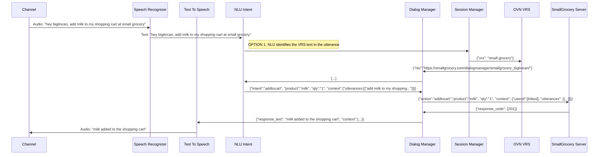
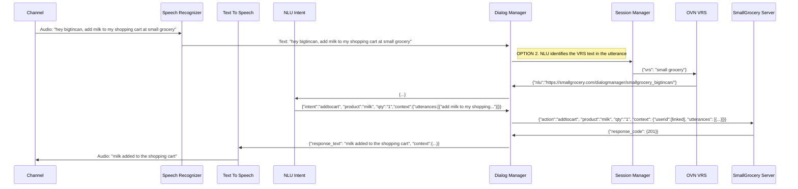
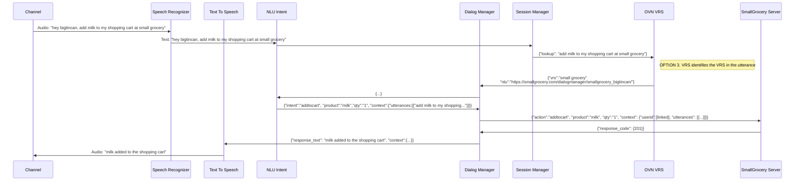

# 2. vrs-type

  

Date: 2021-02-04

  

## Status

  

In Progress

  

Supercedes [1. Record architecture decisions](0001-record-architecture-decisions.md)

  

Superceded by [3. vrs-integration](0003-vrs-integration.md)

## Context

The Voice Assistance Platform's job is to identify if the call is implicit or an explicit utterance. If explicit, then it will engage and call VRS.

Our goal is to identify who is responsible for determining the VRS in the utterance.

## Solution Options

  **Issue 1:**
| Options | Pros | Cons |
|--|--|--|
| Option 1. Create a VRS entity in NLU. | - easier for slot to identify.  - align in the role of NLU  | - risk of inconsistency in understanding VRS entity   |
| ~~Option 2. Dialog Manager identifies when utterance is explicit |  | - creating a separation of understanding the utterance   - risk of inconsistency in understanding VRS type~~ |
| Option 3. VRS will decide the VRS entity in the utterance | - consistent logic for vrs identification across different VRS  | - VRS will have to receive the whole utterance.   - VRS will need to deal with privacy and security   - adds significant complexity to the VRS. VRS will require to have its own NLU.   |

### Sequence Diagrams

#### Option 1

    
  

    

 

#### Option 2

    

   

 

#### Option 3

    

   
 

## Decision
Based on the meeting's (03.04.2021) discussion, the quorum for the best part forward is option 1. The biggest reason is keeping the role of the VRS as straightforward as possible. The team acknowledged that the lower-level details solutions need to be done in partnership with Voice Assistant Platform.
  
 

## Consequences

The possible inconsistencies of identifying VRS entity in an utterance by different Voice Assistant Platform.
