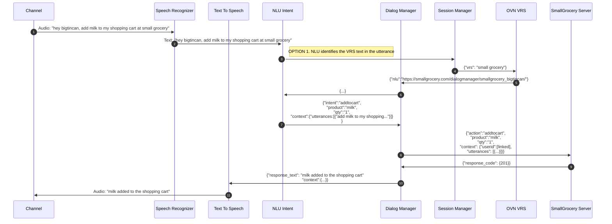
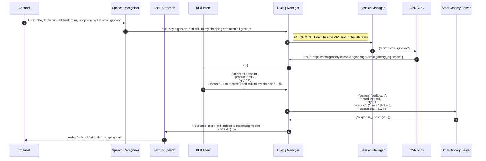
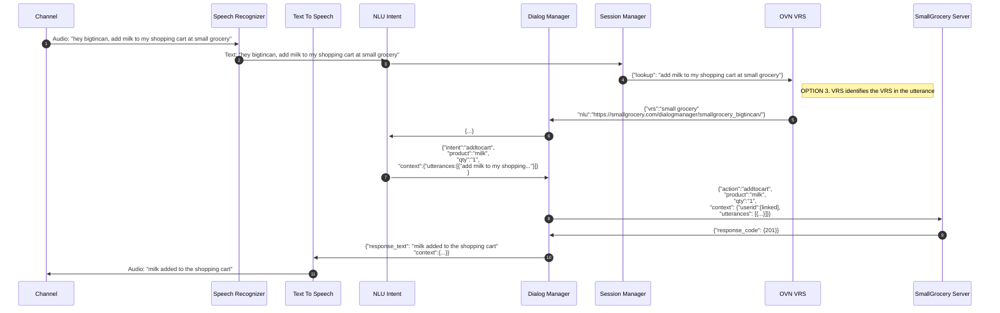

# 2. vrs-type

  

Date: 2021-02-04

  

## Status

  

In Progress

  

Supercedes [1. Record architecture decisions](0001-record-architecture-decisions.md)

  

## Context

The Voice Assistance Platform's job is to identify if the call is implicit or an explicit utterance. If explicit, then it will engage and call VRS.

Our goal is to identify who is responsible for determining the VRS in the utterance.

## Solution Options

  **Issue 1:**
| Options | Pros | Cons |
|--|--|--|
| Option 1. Create a VRS entity and VRS type in NLU. | - easier for slot to identify.  - align in the role of NLU  | - risk of inconsistency in understanding VRS type   |
| Option 2. Dialog Manager identifies when utterance is explicit |  | - creating a separation of understanding the utterance   - risk of inconsistency in understanding VRS type |
| Option 3. VRS will decide the vrs type in the utterance | - consistent logic for vrs identification across different VRS  | - VRS will have to receive the whole utterance.   - VRS will need to deal with privacy issue  |

### Sequence Diagrams

#### Option 1

    
  

    

#### Option 2

    
  

   

#### Option 3

    
  

   
  

## Decision

  

//to-do

  

## Consequences

//to-do
