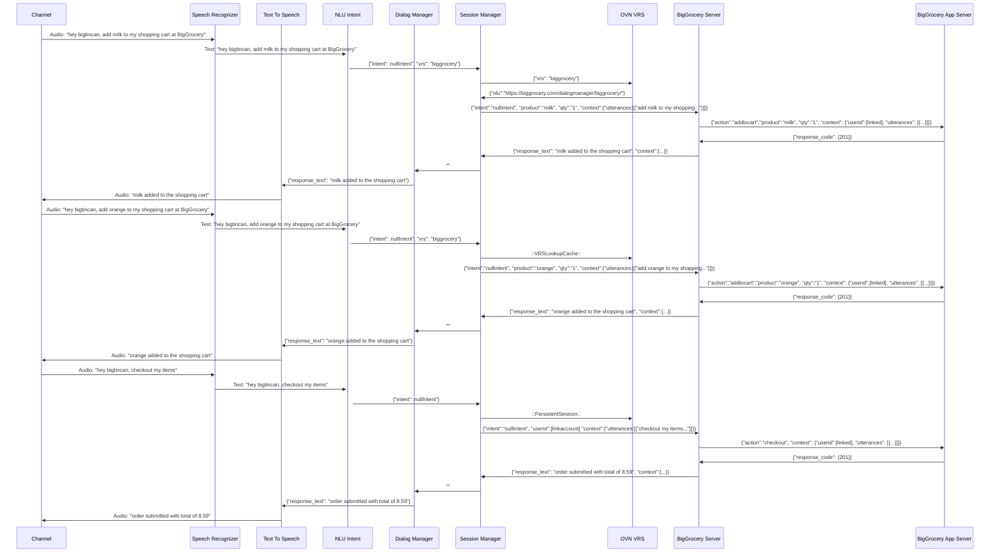

# Overview
Due to the Voice world's complexity, OVN recognized that there are multiple patterns that we have to consider in creating voice standards and making them open and interoperable.

## Pattern 1
**Scenario:** The organization(BigGrocery) has its own NLU and Dialog Manager.<br>
**Use-case:**   Add milk and orange to my shopping cart at BigGrocery - then pay using the BigGrocery payment system. 



## Pattern 2
**Scenario:** The organization(SmallGrocery) use the Conversation Platform dialog manager and NLU.<br>
**Use-case:**   Add milk to my shopping cart at SmallGrocery - then pay using the SmallGrocery payment system. 

```mermaid
sequenceDiagram
participant C as Channel
participant SR as Speech Recognizer
participant TTS as Text To Speech
participant NLU as NLU Intent
participant DM as Dialog Manager
participant SM as Session Manager
participant VRS as OVN VRS
participant SGA as SmallGrocery App Server


C ->> SR: Audio: "hey bigtincan, add milk to my shopping cart at SmallGrocery"
SR ->>+ NLU: Text: "hey bigtincan, add milk to my shopping cart at SmallGrocery" 
NLU ->> DM: {"vrs":"smallgrocery", "intent":"addtocart", "product":"milk", "qty":"1",  "context":{"utterances:[{"add milk to my shopping..."}]}}
DM ->> SM:  ""
SM ->> VRS: {"vrs": "smallgrocery"}
//I am here
VRS ->> SM: {"nlu":"https://smallgrocery.com/dialogmanager/smallgrocery/"}
SM ->> SG: {"intent":"addtocart", "product":"milk", "qty":"1",  "context":{"utterances:[{"add milk to my shopping..."}]}}
SG ->> SGA: {"action":"addtocart","product":"milk",  "qty":"1",  "context": {"userid":[linked], "utterances": [{...}]}}
SGA ->> SG: {"response_code": {201}}
SG ->> SM: {"response_text": "milk added to the shopping cart", "context":{...}}
SM ->> DM: ""
DM ->> TTS: {"response_text": "milk added to the shopping cart"}
TTS ->> C: Audio: "milk added to the shopping cart"
C ->> SR: Audio: "hey bigtincan, checkout my items"
SR ->>+ NLU: Text: "hey bigtincan, checkout my items" 
NLU ->> SM:  {"intent": nullIntent"}
SM ->> VRS: ::PersistentSession::
SM ->> BG: {"intent":"nullIntent", "userid":[linkaccount]  "context":{"utterances:[{"checkout my items..."}]}}
BG ->> SGA: {"action":"checkout", "context": {"userid":[linked], "utterances": [{...}]}}
SGA ->> BG: {"response_code": {201}}
BG ->> SM: {"response_text": "order submitted with total of 8.59", "context":{...}}
SM ->> DM: ""
DM ->> TTS: {"response_text": "order submitted with total of 8.59"}
TTS ->> C: Audio: "order submitted with total of 8.59"
```